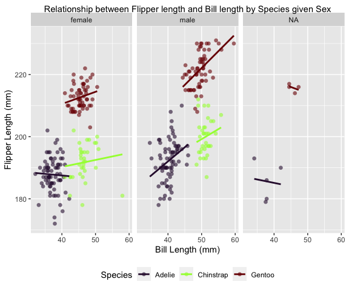

PUBH 7462 - Homework 1
================
Maykon da Silva
1/30/2022

## Problem 2.1 - Independent Bivariate Normal Random Sample

``` r
# Creating a tibble with 3 variables
tibble_hw1 <- tibble(
  x = rnorm(n = 1000, mean = 0, sd = 1),
  y = rnorm(n = 1000, mean = 1, sd = 2),
  sum_indicator = ifelse(test = x + y > 0.5, yes = TRUE, no = FALSE)
)

# Mutating "sum_indicator" variable to "Yes" and "No" and creating a ggplot
tibble_hw1 %>%
  mutate(sum_indicator = factor(ifelse(sum_indicator, "Yes", "No"))) %>%
  ggplot(aes(x = x, y = y, colour = fct_relevel(sum_indicator, "Yes", "No"))) +
  geom_point(alpha = 0.3,
             size  = 2,
             shape = 16) +
  geom_smooth(formula = y ~ x,
              method  = "loess",
              se      = FALSE) +
  scale_colour_viridis_d("X + Y > 0.5", option = "turbo") +
  labs(title = "Independent Bivariate Normal Random Sample") +
  xlab("X ~ N(0, 1)") +
  ylab("Y ~ N(1, 2)")
```


## Problem 2.2 - Penguin EDA

``` r
# Read data with relative path
penguin.df <- read_rds("./data/penguin.RDS")
```

### Problem 2.2.1 - Data Description

The “penguins” data set, found in the package “palmerpenguins” describes
size measurements for adult foraging penguins near Palmer Station,
Antarctica. More specifically, it includes measurements such as flipper
length (mm), body mass (g), bill length (mm), and bill depth (mm) for
three species (Adelie, Chinstrap, and Gentoo) and their respective sex
(female and male) from three different islands (Biscoe, Dream and
Torgersen). Observations for each of these variables were obtained from
three years of study: 2007, 2008, and 2009. Therefore, the data set
contains:

``` r
# Determining the number of rows and columns from the penguins data set
penguin_rows <- nrow(penguin.df)
penguin_columns <- ncol(penguin.df)
```

  - 8 Variables: species, island, bill length (mm), bill depth (mm),
    flipper length (mm), body mass (g), sex, and year.

  - 344 observations/rows: each observation is a combination of all 8
    variables and their levels (as described above). As an example, row
    1 describes the bill length (39.1 mm), bill depth (18.7 mm), flipper
    length (181 mm) and body mass (3750 g) for a male Adelie penguin
    located in the Torgersen island in 2007.

<!-- end list -->

``` r
# Calculating the mean and standard deviation for flipper length and bill length
penguin.df_summary <- penguin.df %>%
  summarise(mean_flipper.length = mean(flipper_length_mm, na.rm = TRUE),
            mean_bill.length = mean(bill_length_mm, na.rm = TRUE),
            sd_flipper.length = sd(flipper_length_mm, na.rm = TRUE),
            sd_bill.length = sd(bill_length_mm, na.rm = TRUE)) %>%
  round(2)
```

The mean and standard deviation of flipper and bill length (mm) for
these data set are as follows:

  - Mean flipper length (mm) = 200.92

  - Mean bill length (mm) = 43.92

  - Standard deviation of flipper length = 14.06

  - Standard deviation of bill length = 5.46

### Problem 2.2.2 Visualization

``` r
# Scatter plot of flipper length (y) by bill length (x), coloured by species
penguin.df %>%
  ggplot(aes(x = bill_length_mm, y = flipper_length_mm, colour = species)) +
  geom_point(alpha = 0.6,
             size = 2,
             shape = 16) +
  geom_smooth(formula = y ~ x,
              method  = "lm",
              span    = 1,
              se      = FALSE) +
  labs(title = "Relationship between Flipper length and Bill length by Species") +
  ylab("Flipper Length (mm)") +
  xlab("Bill Length (mm)") +
  scale_colour_viridis_d("Species", option = "turbo")
```


``` r
# Scatter plot of flipper length (y) by bill length (x), coloured by species and separated by sex
penguin.df %>%
  ggplot(aes(x = bill_length_mm, y = flipper_length_mm, colour = species)) +
  facet_wrap(~sex) +
  geom_point(alpha = 0.6,
             size  = 2,
             shape = 16) +
  geom_smooth(formula = y ~ x,
              method  = "lm",
              span    = 1,
              se      = FALSE) +
  labs(title = "Relationship between Flipper length and Bill length by Species given Sex") +
  ylab("Flipper Length (mm)") +
  xlab("Bill Length (mm)") +
  scale_colour_viridis_d("Species", option = "turbo")
```



As shown by the plot above, there is a strong positive association
between flipper length and bill length for all species of males
penguins. This means that an increase in flipper length can be expected
for an increase in bill length and vice-verse. However, for female
penguins, this association does not seem to be as strong as for males.
In addition, a small negative association between these two variables
can be seen for the Adelie species, which means that a decrease in
flipper length can be expected for an increase in bill length. It is
important to point out that these relationships are not 1:1. A
correlation analysis such as Pearson would present a better summary of
the association between these two variables.
